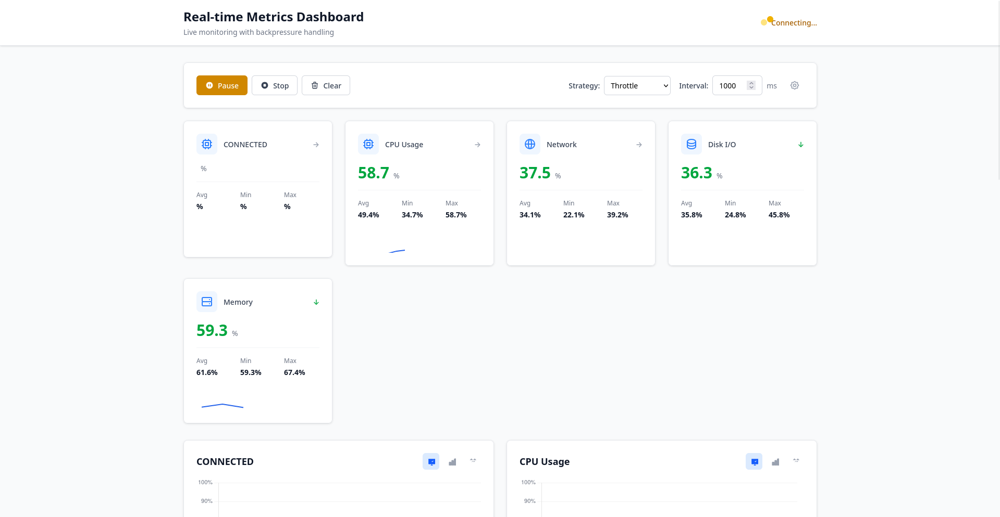

# Real-time Metrics Dashboard

A production-grade Angular application demonstrating real-time data streaming with WebSocket, advanced RxJS operators, and intelligent backpressure handling.



## The Problem

Most monitoring dashboards fail under real-world conditions:
- **Network instability**: Connections drop, reconnections needed
- **Data bursts**: Servers send 100+ updates/second during spikes
- **Backend errors**: 5xx errors, timeouts, malformed data
- **Browser performance**: UI freezes when overwhelmed with updates

This project demonstrates how to handle all of these scenarios elegantly.

## Features

### Core Functionality
- Real-time WebSocket connection with auto-reconnect
- Multiple backpressure strategies (throttle, debounce, buffer, sample)
- Live metrics visualization with Chart.js
- Connection state management
- Error tracking and display
- Pause/Resume stream without disconnecting
- Responsive design with Tailwind CSS

### Technical Highlights
- Angular 21+ with standalone components
- Signals for reactive state management
- Custom RxJS operators for backpressure
- OnPush change detection everywhere
- Type-safe throughout (no `any` types)
- Mock backend with realistic network conditions

## Architecture

### State Management Strategy

**Why NOT NgRx for this project?**
- Lightweight scope - only managing metrics stream state
- Signals provide excellent DX for simple reactive state
- No need for DevTools time-travel debugging here
- Demonstrates understanding of when NOT to over-engineer

**When I WOULD use NgRx:**
- Multi-feature apps with complex state interactions
- Need for state persistence/hydration
- Team prefers Redux patterns
- DevTools debugging is critical

### Backpressure Handling

The app implements 4 different strategies:

1. **Throttle** (default)
   - Emits first value, ignores rest for interval
   - Best for: Rate-limiting user actions
   - Use case: Prevent double-clicks, rapid API calls

2. **Debounce**
   - Waits for "silence" before emitting
   - Best for: Search-as-you-type
   - Use case: Wait until user stops typing

3. **Buffer**
   - Collects values into batches
   - Best for: Batch processing
   - Use case: Send 10 analytics events at once

4. **Sample**
   - Emits most recent value at intervals
   - Best for: High-frequency data sampling
   - Use case: Stock prices, sensor data

**See implementation:** `src/app/shared/operators/backpressure.operator.ts`

### Component Architecture

```
DashboardComponent (Smart)
├── StreamControlsComponent (Smart)
│   └── Manages: play/pause/stop, strategy selection
├── MetricCardComponent (Dumb) x4
│   └── Displays: current value, trend, sparkline
├── ChartWidgetComponent (Dumb) x4
│   └── Visualizes: historical data with Chart.js
├── ConnectionStatusComponent (Dumb)
│   └── Shows: connection state, latency, reconnect attempts
└── ErrorListComponent (Dumb)
    └── Lists: errors with severity, retryability
```

**Smart vs Dumb:**
- **Smart**: Inject services, handle business logic, manage state
- **Dumb**: Props in, events out, pure presentation

### WebSocket Service Design

```typescript
WebSocketService
├── Auto-reconnect with exponential backoff
├── Graceful error handling
├── Connection state observable
├── Message parsing and validation
└── Cleanup on destroy
```

**Key decisions:**
- `shareReplay` to prevent multiple WebSocket connections
- `takeUntilDestroyed` for automatic cleanup
- Exponential backoff: 1s → 2s → 4s → 8s → ... → 30s max
- Max 10 reconnection attempts before giving up

## Getting Started

### Prerequisites
- Node.js 18+ 
- npm 9+

### Installation

```bash
# Clone repository
git clone https://github.com/kamilszwaradzki/realtime-dashboard.git
cd realtime-dashboard

# Install frontend dependencies
npm install

# Install backend dependencies
cd backend
npm install
cd ..
```

### Running Locally

**Terminal 1 - Backend:**
```bash
cd backend
npm start
```

**Terminal 2 - Frontend:**
```bash
npm start
```

Open `http://localhost:4200`

### Configuration

Backend server settings in `backend/server.js`:
```javascript
const PORT = 3000;
const METRIC_INTERVAL = 1000;        // Metrics frequency
const BURST_PROBABILITY = 0.15;      // 15% chance of burst
const ERROR_PROBABILITY = 0.05;      // 5% chance of error  
const DISCONNECT_PROBABILITY = 0.02; // 2% chance of disconnect
```

## Mock Backend

The backend simulates real-world conditions:

### Realistic Metrics
- **CPU**: baseline 45%, variance ±25%, occasional spikes
- **Memory**: baseline 60%, variance ±15%, slow growth
- **Network**: baseline 30%, variance ±40%, high variability
- **Disk**: baseline 25%, variance ±20%, stable

### Simulated Issues
- **Bursts**: 15% chance of 3-10 metrics at once
- **Errors**: 5% chance of timeout/rate-limit/server errors
- **Disconnects**: 2% chance of connection drop
- **Latency**: Random 0-50ms delays per message

### Error Types
- `TIMEOUT`: Request timeout (retryable)
- `RATE_LIMIT`: Rate limit exceeded (retryable)
- `SERVER_ERROR`: 500 Internal Server Error (retryable)
- `NETWORK_ISSUE`: Network connectivity issue (retryable)
- `DATA_CORRUPTION`: Invalid data (non-retryable)

## Testing the Backpressure

1. **Baseline** (Throttle 1000ms):
   - Should see ~1 update/second per metric type
   - Smooth, no lag

2. **Stress Test** (Throttle 100ms):
   - Change interval to 100ms in controls
   - Backend sends bursts of 10 updates
   - UI should remain responsive

3. **Buffer Strategy**:
   - Switch to "Buffer" mode
   - Watch metrics arrive in batches every interval
   - Good for seeing burst patterns

4. **Debounce Strategy**:
   - Switch to "Debounce" 
   - Notice delay before updates appear
   - Simulates "wait until settled" behavior

## UI/UX Decisions

### Why Tailwind CSS?
- **Speed**: Rapid prototyping without naming classes
- **Consistency**: Design tokens out of the box
- **Bundle size**: PurgeCSS removes unused styles
- **Modern**: Industry standard, shows current stack knowledge

**Alternative considered:**
- Angular Material: Good for enterprise, but heavy bundle
- SCSS only: More control, but slower development

### Chart.js over Recharts
- **Browser compatibility**: Works everywhere
- **Performance**: Canvas-based, handles 1000s of points
- **Customization**: Full control over appearance
- **Bundle size**: Smaller than D3

## Performance Optimizations

1. **OnPush Change Detection**
   - All components use `ChangeDetectionStrategy.OnPush`
   - Reduces unnecessary re-renders
   - Critical for real-time updates

2. **TrackBy Functions**
   - Used in `*ngFor` for metric cards/charts
   - Prevents DOM thrashing on updates

3. **Computed Signals**
   - Derived state automatically memoized
   - No redundant calculations

4. **Canvas Rendering**
   - Chart.js uses Canvas, not SVG
   - Better performance for animations

5. **Lazy Loading** (future)
   - Dashboard could be lazy-loaded
   - Not implemented yet (single-page app)

## Error Handling Strategy

### Three Layers of Error Handling

1. **WebSocket Service Level**
   - Connection errors → trigger reconnect
   - Message parse errors → log + skip
   - Network errors → exponential backoff

2. **Store Level**
   - Stream errors → add to error list
   - Invalid metrics → filter out
   - State corruption → reset to initial

3. **UI Level**
   - Display errors to user
   - Provide manual retry option
   - Show connection state clearly

### Why This Matters
Most dashboards silently fail. This shows:
- User knows what's happening
- Errors are retryable when possible
- System recovers gracefully

## Deployment

### Vercel (Recommended)

**Frontend:**
```bash
# Install Vercel CLI
npm i -g vercel

# Deploy
vercel --prod
```

**Backend:**
- Deploy to Render/Railway/Fly.io (WebSocket support needed)
- Update `WS_URL` in `websocket.service.ts`

### Docker (Alternative)

```dockerfile
# Frontend
FROM node:18-alpine AS frontend
WORKDIR /app
COPY package*.json ./
RUN npm ci
COPY . .
RUN npm run build

# Backend
FROM node:18-alpine AS backend
WORKDIR /app
COPY backend/package*.json ./
RUN npm ci
COPY backend/ .

# Combine
FROM nginx:alpine
COPY --from=frontend /app/dist /usr/share/nginx/html
# Use a process manager for both nginx + node backend
```

## Future Enhancements

If I had more time, I would add:

1. **Persistence**
   - Save selected strategy to localStorage
   - Store metric history for session replay

2. **Alerts**
   - Threshold-based notifications
   - Browser notifications API
   - Email/Slack webhooks

3. **Tests**
   - Unit tests for operators (high value)
   - Component tests with Testing Library
   - E2E with Playwright

4. **Multiple Dashboards**
   - Switch between different metric sets
   - Compare time periods

5. **SSE Fallback**
   - Server-Sent Events when WebSocket fails
   - Progressive enhancement

## License

MIT

## Author

**Kamil Szwaradzki**
- GitHub: [@kamilszwaradzki](https://github.com/kamilszwaradzki)
- LinkedIn: [Kamil Szwaradzki](https://linkedin.com/in/kamil-szwaradzki)

---

## Learn More

**Key Resources:**
- [RxJS Backpressure](https://rxjs.dev/guide/operators)
- [Angular Signals](https://angular.dev/guide/signals)
- [WebSocket API](https://developer.mozilla.org/en-US/docs/Web/API/WebSocket)
- [Chart.js Docs](https://www.chartjs.org/docs/)